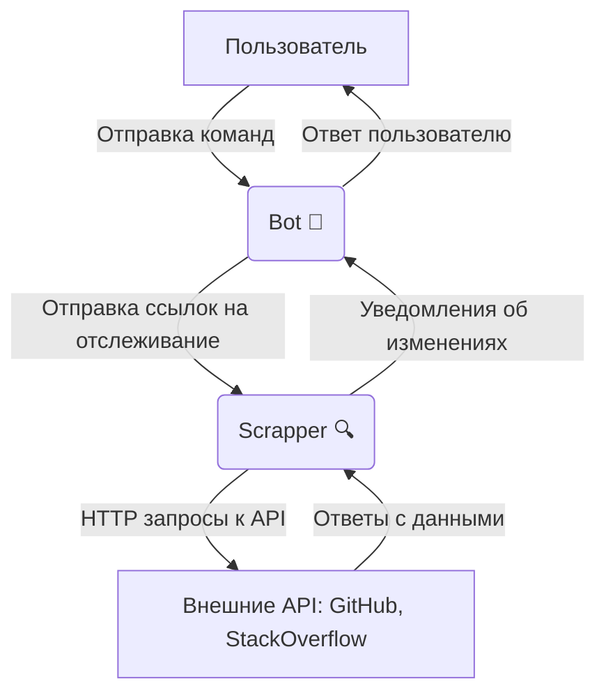

# Link Tracker 🔗

Это приложение позволяет следить за активностью на StackOverflow и GitHub, предоставляя пользователям возможность получать уведомления об изменениях на отслеживаемых ссылках.

Проект состоит из двух приложений, взаимодействующих по HTTP:

1. **Bot 🤖** – обрабатывает команды пользователей, ведёт диалог и управляет состоянием (реализована машина состояний для корректного ведения диалога).
2. **Scrapper 🔍** – отвечает за проверку ссылок и отправку уведомлений при обнаружении изменений.



---

#### Бот поддерживает следующие команды:

- **/start** – регистрация пользователя. 👋
- **/help** – вывод списка доступных команд. ℹ️
- **/track** – начало отслеживания ссылки. 📌
- **/untrack** – прекращение отслеживания ссылки. ❌
- **/list** – вывод списка отслеживаемых ссылок. 📋

При добавлении ссылки бот проверяет, не отслеживается ли она уже, и, в случае дублирования, уведомляет пользователя соответствующим сообщением.

---

### 🚀 **Запуск проекта**

1. Клонируйте репозиторий:

```bash
git clone git@github.com:central-university-dev/go-LLIEPJIOK.git
cd go-LLIEPJIOK
```

2. Создайте и заполните файл _.env_ по примеру файла _example.env_
3. Для запуска бота введите следующую команду:

```bash
make run_bot
```

4. Для запуска scrapper введите следующую команду:

```bash
make run_scrapper
```
